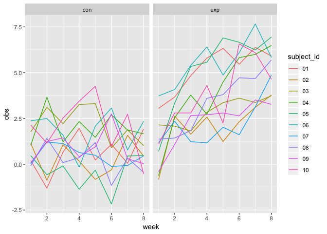
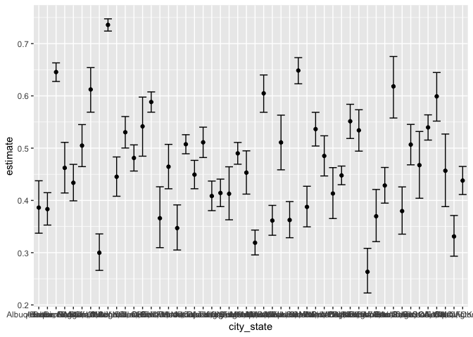

p8105\_hw5\_gwk2111
================
Zach Keefer
11/7/2018

Problem 1
---------

Create a tidy dataframe containing data from all participants, including the subject ID, arm, and observations over time:

``` r
study_df = 
  ##Creating a data frame of the file names
  tibble(files = list.files(path = "./data", full.names = TRUE)) %>% 
  mutate(data = map(files, read.csv)) %>% 
  unnest() %>% 
  janitor::clean_names() %>% 
  ##Cleaning the names of each participant
  mutate(files = str_sub(files, start = 8, end = 13)) %>% 
  ##Separating the arms of the study and the id of each subject
  separate(files, into = c("control_arm", "subject_id"), sep = "_") %>% 
  gather(key = week, value = obs, week_1:week_8) %>% 
  mutate(week = str_sub(week, start = 6, end = 6),
         week = as.numeric(week))
```

Make a spaghetti plot showing observations on each subject over time:

``` r
ggplot(study_df, aes(x = week, y = obs, color = subject_id)) +
  geom_line() +
  ##Facetting the plot by controls and experiments to better visualize differences between the two groups.
  facet_grid(~control_arm) +
  labs(y = "Observation",
       x = "Week",
       color = "Subject ID")
```



There is a clear difference between the two groups over time. While the control group stays fairly level in their observation level, the experiment group increases over time.

Problem 2
---------

``` r
homicide_df = read.csv("https://raw.githubusercontent.com/washingtonpost/data-homicides/master/homicide-data.csv") %>% 
  janitor::clean_names() %>% 
  mutate(city_state = str_c(city, state, sep = ", ")) %>% 
  #I decided to eliminate Tulsa, AL because it was a wrongly entered data point
  filter(city_state != "Tulsa, AL")
```

The following data set is from the Washington Post. It is data on homicides in 50 large U.S. cities. Before adding the city\_state variable and eliminating Tulsa, AL, the data set contained 52,179 obvservations and 12 variables. Each observation has a unique id, and describes the name, race, and sex of the victim, as well as the report date of the homicide, the location of the homicide and the status of the investigation. The variables of interest in the data set are `city` and `state`, which are combined above to create the `city_state` variable, and the `disposition` variable which describes the status of the investigation of each homicide.

Summarize within cities to obtain the total number of homicides and the number of unsolved homicides:

``` r
homicides = group_by(homicide_df, city_state) %>% 
  summarize(n_homicide = n(),
            n_unsolved = sum(disposition == "Closed without arrest" | disposition == "Open/No arrest")) 
  
  knitr::kable(homicides)
```

| city\_state        |  n\_homicide|  n\_unsolved|
|:-------------------|------------:|------------:|
| Albuquerque, NM    |          378|          146|
| Atlanta, GA        |          973|          373|
| Baltimore, MD      |         2827|         1825|
| Baton Rouge, LA    |          424|          196|
| Birmingham, AL     |          800|          347|
| Boston, MA         |          614|          310|
| Buffalo, NY        |          521|          319|
| Charlotte, NC      |          687|          206|
| Chicago, IL        |         5535|         4073|
| Cincinnati, OH     |          694|          309|
| Columbus, OH       |         1084|          575|
| Dallas, TX         |         1567|          754|
| Denver, CO         |          312|          169|
| Detroit, MI        |         2519|         1482|
| Durham, NC         |          276|          101|
| Fort Worth, TX     |          549|          255|
| Fresno, CA         |          487|          169|
| Houston, TX        |         2942|         1493|
| Indianapolis, IN   |         1322|          594|
| Jacksonville, FL   |         1168|          597|
| Kansas City, MO    |         1190|          486|
| Las Vegas, NV      |         1381|          572|
| Long Beach, CA     |          378|          156|
| Los Angeles, CA    |         2257|         1106|
| Louisville, KY     |          576|          261|
| Memphis, TN        |         1514|          483|
| Miami, FL          |          744|          450|
| Milwaukee, wI      |         1115|          403|
| Minneapolis, MN    |          366|          187|
| Nashville, TN      |          767|          278|
| New Orleans, LA    |         1434|          930|
| New York, NY       |          627|          243|
| Oakland, CA        |          947|          508|
| Oklahoma City, OK  |          672|          326|
| Omaha, NE          |          409|          169|
| Philadelphia, PA   |         3037|         1360|
| Phoenix, AZ        |          914|          504|
| Pittsburgh, PA     |          631|          337|
| Richmond, VA       |          429|          113|
| Sacramento, CA     |          376|          139|
| San Antonio, TX    |          833|          357|
| San Bernardino, CA |          275|          170|
| San Diego, CA      |          461|          175|
| San Francisco, CA  |          663|          336|
| Savannah, GA       |          246|          115|
| St. Louis, MO      |         1677|          905|
| Stockton, CA       |          444|          266|
| Tampa, FL          |          208|           95|
| Tulsa, OK          |          583|          193|
| Washington, DC     |         1345|          589|

Estimate proportion of homicides unsolved in Baltimore, pull proportions and CI's:

``` r
balt_homicides = filter(homicides, city_state == "Baltimore, MD") 
##This creates the R object
balt_prop = prop.test(balt_homicides$n_unsolved, balt_homicides$n_homicide)
##Tidying and selecting output
broom::tidy(balt_prop) %>% 
  select(estimate, conf.low, conf.high)
```

    ## # A tibble: 1 x 3
    ##   estimate conf.low conf.high
    ##      <dbl>    <dbl>     <dbl>
    ## 1    0.646    0.628     0.663

Estimate proportion of homicides for each city, create a tidy data frame with estimated proportions and CIs for each city:

``` r
##Creating a function to use below in order to run prop.test for each city in the data frame
prop_function = function(df) {
  prop_estimate = prop.test(df$n_unsolved, df$n_homicide)
  
  broom::tidy(prop_estimate) %>% 
    select(estimate, conf.low, conf.high)
}
```

``` r
##Running prop.test using the function created above
us_prop_df = nest(homicides, n_homicide, n_unsolved) %>%
  mutate(us_prop = map(data, prop_function)) %>% 
  unnest()
```

Create a plot that shows the estimates and CIs for each city:

``` r
us_prop_df %>% 
  mutate(city_state = forcats::fct_reorder(city_state, estimate)) %>% 
  ggplot(aes(x = city_state, y = estimate)) +
  geom_point() +
  geom_errorbar(aes(ymin = conf.low, ymax = conf.high)) +
  theme(axis.text.x = element_text(angle = 68, hjust = 1)) +
  labs(x = "City",
       y = "Proportion of Unsolved Homicides")
```


