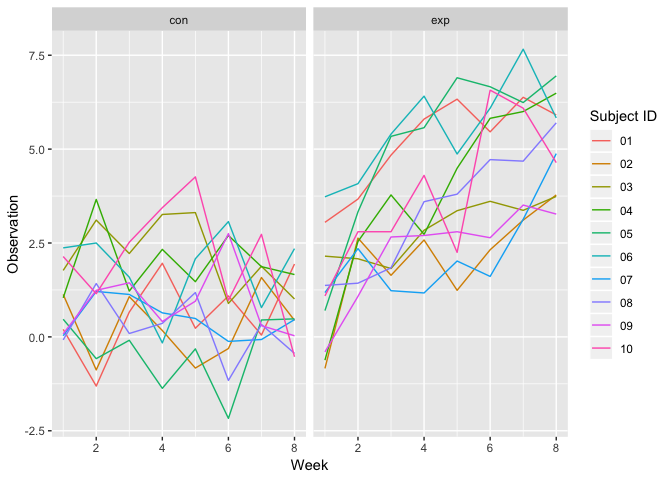
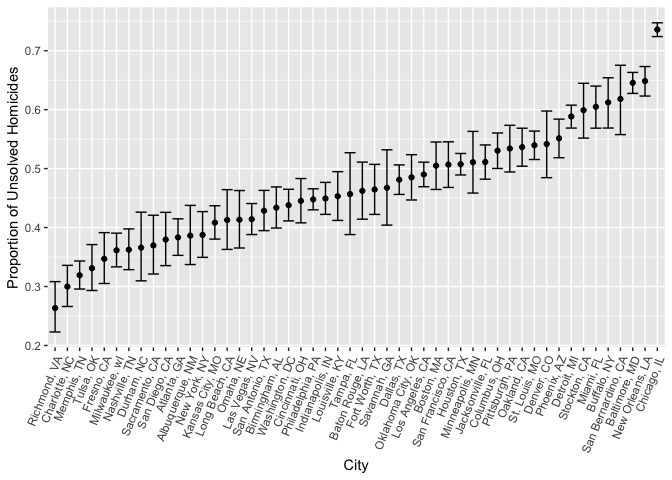

p8105\_hw5\_gwk2111
================
Zach Keefer
11/7/2018

Problem 1
---------

``` r
study_df = 
  tibble(files = list.files(path = "./data", full.names = TRUE)) %>% 
  mutate(data = map(files, read.csv)) %>% 
  unnest() %>% 
  janitor::clean_names() %>% 
  mutate(files = str_sub(files, start = 8, end = 13)) %>% 
  separate(files, into = c("control_arm", "subject_id"), sep = "_") %>% 
  gather(key = week, value = obs, week_1:week_8) %>% 
  mutate(week = str_sub(week, start = 6, end = 6),
         week = as.numeric(week))
```

``` r
ggplot(study_df, aes(x = week, y = obs, color = subject_id)) +
  geom_line() +
  facet_grid(~control_arm)
```



Problem 2
---------

``` r
homicide_df = read.csv("https://raw.githubusercontent.com/washingtonpost/data-homicides/master/homicide-data.csv") %>% 
  janitor::clean_names() %>% 
  mutate(city_state = str_c(city, state, sep = ", ")) %>% 
  filter(city_state != "Tulsa, AL")
```

``` r
homicides = group_by(homicide_df, city_state) %>% 
  summarize(n_homicide = n(),
            n_unsolved = sum(disposition == "Closed without arrest" | disposition == "Open/No arrest")) 
  
  knitr::kable(homicides)
```

| city\_state        |  n\_homicide|  n\_unsolved|
|:-------------------|------------:|------------:|
| Albuquerque, NM    |          378|          146|
| Atlanta, GA        |          973|          373|
| Baltimore, MD      |         2827|         1825|
| Baton Rouge, LA    |          424|          196|
| Birmingham, AL     |          800|          347|
| Boston, MA         |          614|          310|
| Buffalo, NY        |          521|          319|
| Charlotte, NC      |          687|          206|
| Chicago, IL        |         5535|         4073|
| Cincinnati, OH     |          694|          309|
| Columbus, OH       |         1084|          575|
| Dallas, TX         |         1567|          754|
| Denver, CO         |          312|          169|
| Detroit, MI        |         2519|         1482|
| Durham, NC         |          276|          101|
| Fort Worth, TX     |          549|          255|
| Fresno, CA         |          487|          169|
| Houston, TX        |         2942|         1493|
| Indianapolis, IN   |         1322|          594|
| Jacksonville, FL   |         1168|          597|
| Kansas City, MO    |         1190|          486|
| Las Vegas, NV      |         1381|          572|
| Long Beach, CA     |          378|          156|
| Los Angeles, CA    |         2257|         1106|
| Louisville, KY     |          576|          261|
| Memphis, TN        |         1514|          483|
| Miami, FL          |          744|          450|
| Milwaukee, wI      |         1115|          403|
| Minneapolis, MN    |          366|          187|
| Nashville, TN      |          767|          278|
| New Orleans, LA    |         1434|          930|
| New York, NY       |          627|          243|
| Oakland, CA        |          947|          508|
| Oklahoma City, OK  |          672|          326|
| Omaha, NE          |          409|          169|
| Philadelphia, PA   |         3037|         1360|
| Phoenix, AZ        |          914|          504|
| Pittsburgh, PA     |          631|          337|
| Richmond, VA       |          429|          113|
| Sacramento, CA     |          376|          139|
| San Antonio, TX    |          833|          357|
| San Bernardino, CA |          275|          170|
| San Diego, CA      |          461|          175|
| San Francisco, CA  |          663|          336|
| Savannah, GA       |          246|          115|
| St. Louis, MO      |         1677|          905|
| Stockton, CA       |          444|          266|
| Tampa, FL          |          208|           95|
| Tulsa, OK          |          583|          193|
| Washington, DC     |         1345|          589|

``` r
prop_function = function(df) {
  prop_estimate = prop.test(df$n_unsolved, df$n_homicide)
  
  broom::tidy(prop_estimate) %>% 
    select(estimate, conf.low, conf.high)
}
```

``` r
filter(homicides, city_state == "Baltimore, MD") %>% 
  prop_function()
```

    ## # A tibble: 1 x 3
    ##   estimate conf.low conf.high
    ##      <dbl>    <dbl>     <dbl>
    ## 1    0.646    0.628     0.663

``` r
us_prop_df = nest(homicides, n_homicide, n_unsolved) %>%
  mutate(us_prop = map(data, prop_function)) %>% 
  unnest()
```

``` r
ggplot(us_prop_df, aes(x = city_state, y = estimate)) +
  geom_point() +
  geom_errorbar(aes(ymin = conf.low, ymax = conf.high))
```


